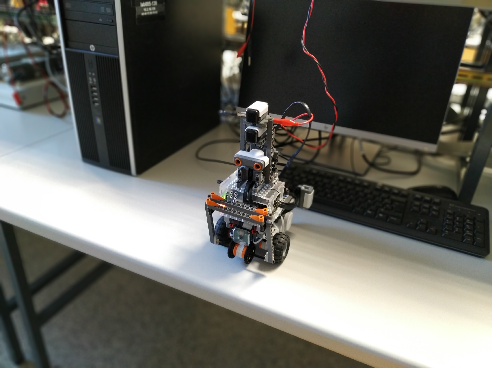

# Machaca-Homer (Rama: Prueba individual)
Grupo R7 de la asignatura Robótica (UNIZAR) 2019.

## Organización de ramas
- individual: Versión usada durante la prueba individual cuyo objetivo es realizar el mayor número de extras posibles.
- carrera: Versión usada durante la carrera cuyo objetivo es completar el recorrido en el menor tiempo posible, eliminando partes extra como el reconocimiento.
- carrera_modo_diablo: Versión basada en la rama "carrera", y cuyo objetivo es obtener el máximo rendimiento del robot, para ello respecto a la versión carrera, se ha paralelizado el acceso a los sensores y se ha mejorado su precisión. Esta versión sólo pudo ser usada durante la primera carrera debido a que aparecía un error en sonar que impedía usarlo (en las pruebas previas a la carrera, esta era la que conseguía mejores resultados).

## Organización del proyecto
- /: Código que utilizado para la realización de la práctica
- /plots/: Ficheros de logs obtenidos tras ejecutar las dos trayectorias en el robot
- /maps/: Mapas
- /reco/: Imagenes de R2-D2 y BB8 usadas durante el reconocimiento
- /test/: Pruebas realizadas sobre distintos componentes
